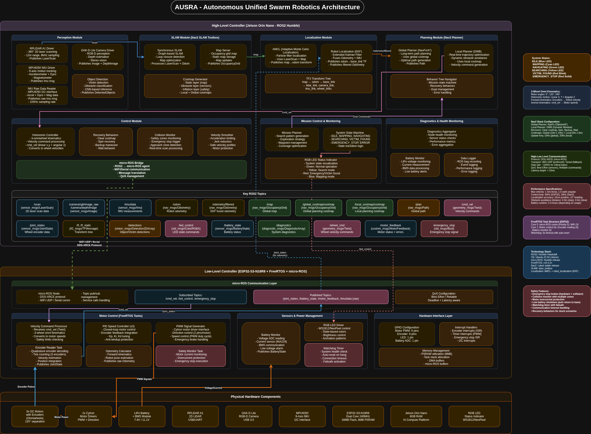

# AUSRA-Autonomous-System

This repository contains the complete ROS 2 software stack for the AUSRA (Autonomous Unified Swarm Robotics Architecture) project. It integrates Perception, SLAM, Navigation (Nav2), and Control for the omnidirectional robot.

## Package Overview

The system implements a high-level/low-level architecture. A **Jetson Orin Nano** runs ROS 2 Humble for high-level tasks like Perception, SLAM, and Navigation, while an **ESP32-S3** runs micro-ROS for real-time motor control and hardware interfacing.



## Build Instructions

To build the autonomy stack and the spawner package:
```bash
cd ~/ausra_gp
colcon build --packages-select AUSRA-Autonomous-System ausra_spawner --symlink-install
source install/setup.bash
```

## Running the Simulation (Workflow)

This package represents **Steps 2 & 3** in the unified AUSRA simulation workflow. Once the Gazebo world is launched (via `ausra_simulation`), use this package to spawn the robot and start its autonomous capabilities.

### Step 2: Spawn Robot & Launch Autonomy

Launch the robot with its full autonomous stack (Controllers, SLAM, Navigation, and the Omni-Driver).

```bash
# Terminal 2: Spawn robot 1 and start Autonomy Stack
ros2 launch ausra_spawner robot_autonomous.launch.py robot_id:=1 x:=0.0 y:=0.0 yaw:=0.0
```

### Step 3: Multi-Robot Support (Optional)

To spawn a second robot in the same simulation, simply run the command again in a new terminal with a different ID and coordinate:

```bash
# Terminal 3: Spawn robot 2
ros2 launch ausra_spawner robot_autonomous.launch.py robot_id:=2 x:=2.0 y:=0.0 yaw:=0.0
```

## Key Parameters & Tuning

### Spawner Parameters (`robot_autonomous.launch.py`)

*   `robot_id`: Unique integer ID (`1`, `2`, etc.). Defines the namespace (`ausra_{id}`) for all topics to avoid multi-robot conflicts.
*   `x`, `y`, `yaw`: Initial spawn coordinates and orientation in meters/radians.
*   `use_sim_time`: `true` (Enabled by default to sync with Gazebo time).

### Nav2 & DWB Controller Tuning

The navigation parameters are heavily tuned for an omnidirectional robot navigating tight spaces. These configurations can be found in `Navigation/config/`:

1.  **DWB Local Planner (Preventing Unnecessary Rotation)**
    Since the robot is holonomic, it can move sideways without turning. To emphasize this behavior, adjust the following inside the DWB configuration:
    *   `max_vel_theta`: Keep this low or zero during pure translation tasks to reduce spinning.
    *   `vtheta_samples`: Number of rotational velocity samples.
    *   **Critics**: The `Twirling` critic is enabled to heavily penalize rotational movement when translational movement is more efficient.

2.  **Costmap Tuning (Tight Spaces)**
    *   **Inflation Radius**: Reduced in both global and local costmaps to allow the robot to pass through narrow doorways or corridors.
    *   **Robot Footprint**: Accurately reflects the radius of the omnidirectional chassis.
